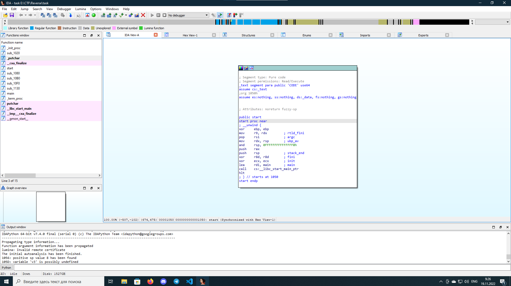
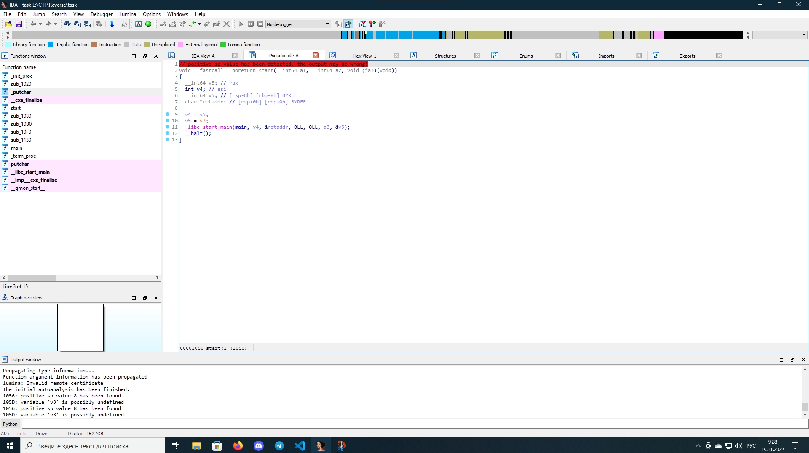
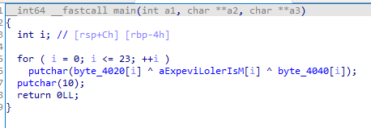
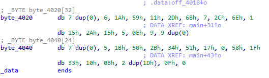
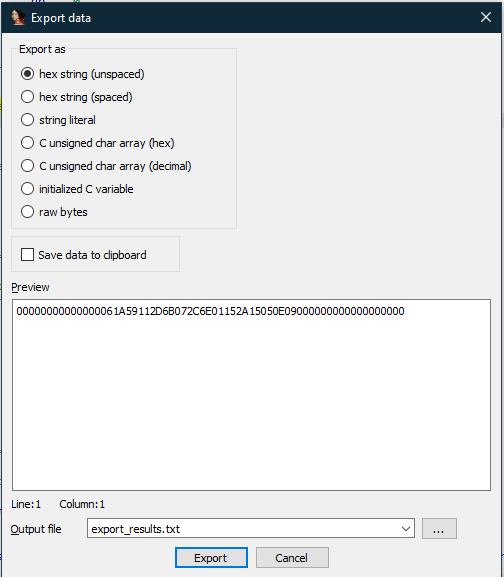
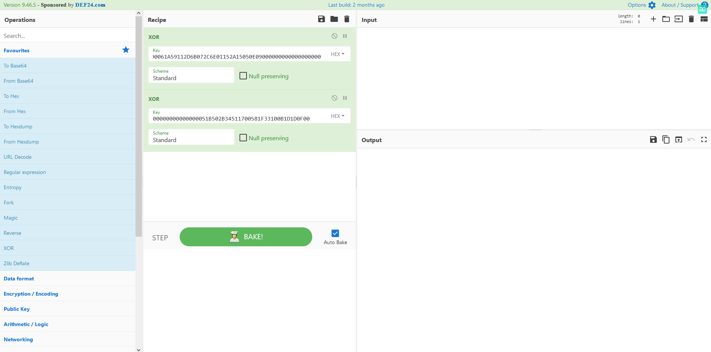
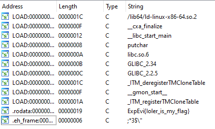
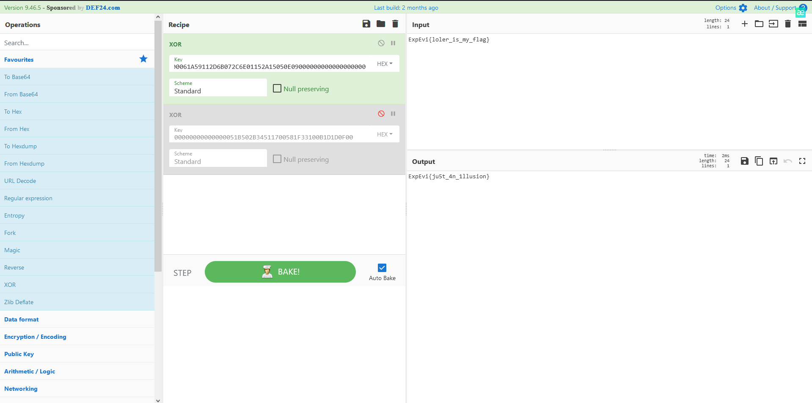

# Bin (1000)

```Ура! Ревёрс бинарей! Дождались!```
<hr>
В таске дан бинарный файл. Открываем его в ida.



Чтобы посмотреть псевдокод надо нажать на клавишу F5. Нажимаем F5 и смотрим код программы



ida показала псевдокод точки входа в программу. Здесь нас интересует функция main. Выберем её в левом меню функций. ida покажет код main и мы посмотрим, что делает этот чёрный ящик



Функция main проходится от 0 до 23 символа флага включительно и ксорит каждый символ флага с 2-мя ключами. Чтобы вытащить эти ключи надо дважды кликнуть по их именам (byte_4020 и byte_4040)



Мы видим 2 массива байт. Это и есть наши ключи. Чтобы не переписывать их руками надо нажать сочетание клавиш Shift+E по названию массива. После нажатия сочетания клавиш откроется такое окно:



В нём выбираем hex string (unspaced) и копируем строчку из окна Preview. Это наш ключ в 16-СС. Запоминаем его. Он нам потом понадобится в качестве ключа для xor в cyberchef. Повторяем действия для второго массива. Кибершеф выглядит пока так:



Теперь мы должны вытащить массив байт, который задан как фейковый флажок. Для этого можно воспользоваться сочетанием клавиш Shift+F12. Это сочетание клавиш вытаскивает все строки из бинарного файла, чья длина 4 или больше и чьи символы печатаемы.



Предпоследняя строка выглядит как то, что нам нужно. Дважды нажимаем и копируем её в CyberChef.


В окне Output можем увидеть флаг, который говорит нам, что один ключ лишний. Давайте переберём 2 варианта с отключением ключа и получим флаг



**FLAG: ExpEvi{ju5t_4n_1llusion}**
